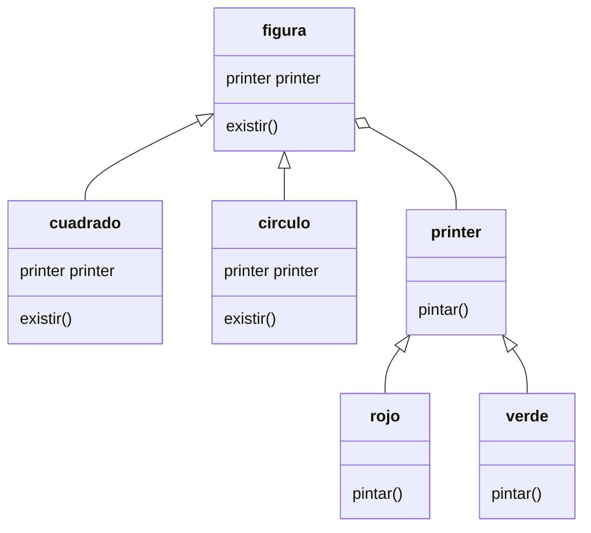

# Integrantes del Equipo
Diego Fernando Martinez Osorio
(algo)
(algo)

# Patron de Diseño: Bridge
Este patrón de diseño permite desacoplar una abstracción de su implementación, de manera que ambas puedan variar de forma independiente.

# Modelo de Clases

## Lenguaje: Python3

