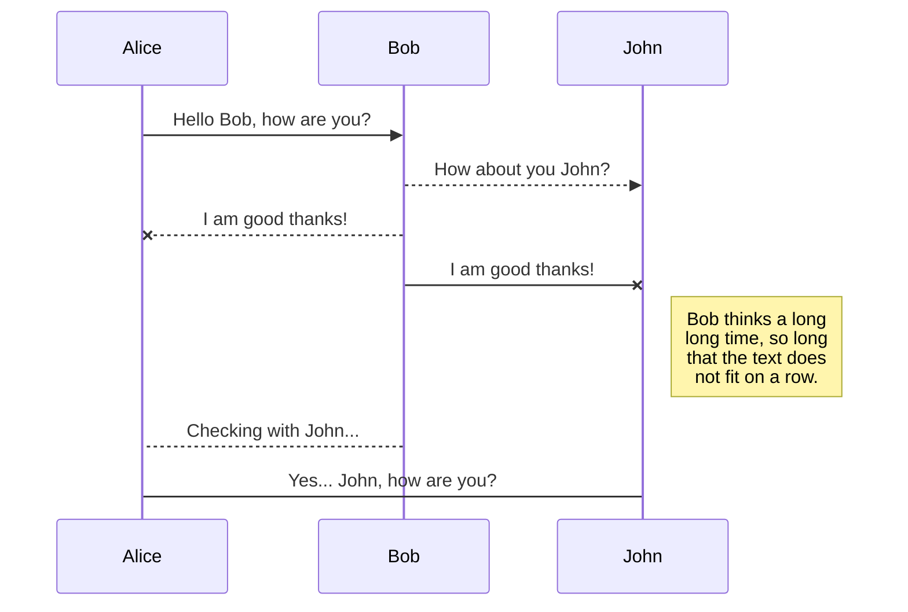
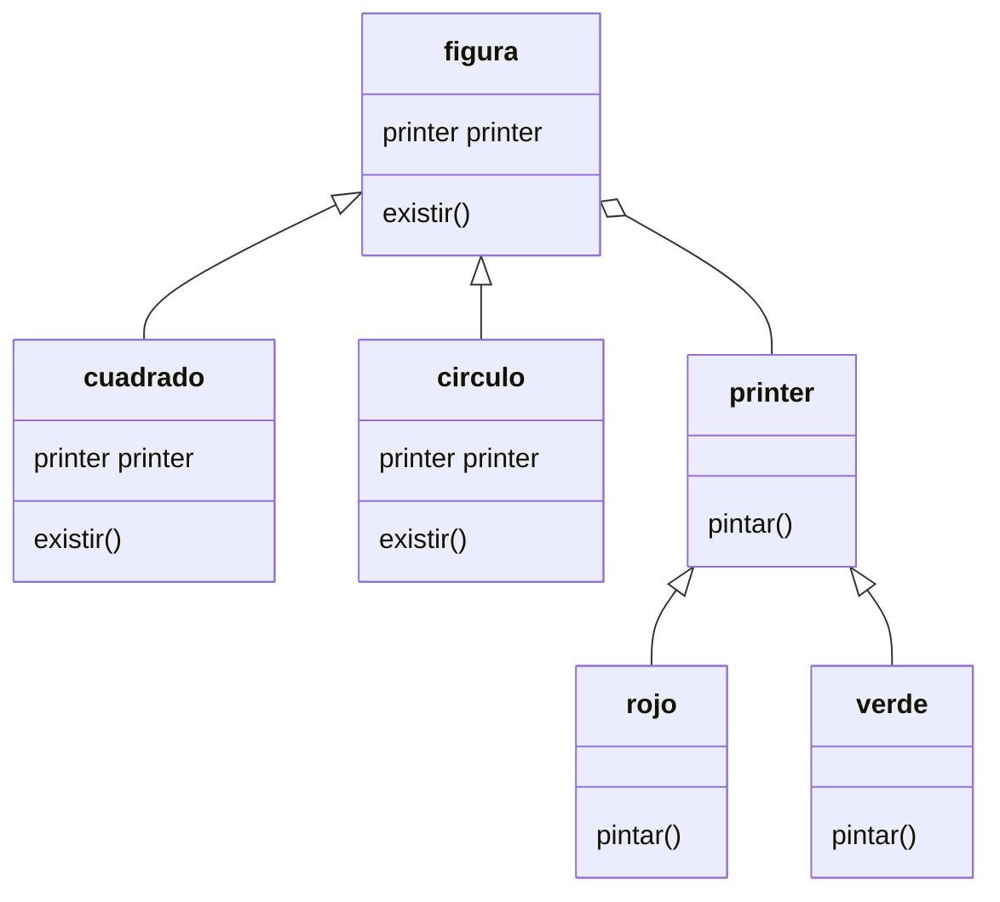

# Integrantes del Equipo
Diego Fernando Martinez Osorio
(algo)
(algo)

# Patron de Diseño: Bridge
Este patrón de diseño permite desacoplar una abstracción de su implementación, de manera que ambas puedan variar de forma independiente.

# Modelo de Clases

## UML diagrams

You can render UML diagrams using [Mermaid](https://mermaidjs.github.io/). For example, this will produce a sequence diagram:

And this will produce a flow chart:

## Lenguaje: Python3

